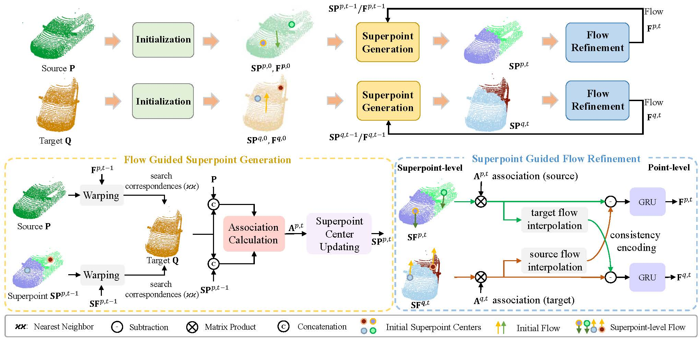
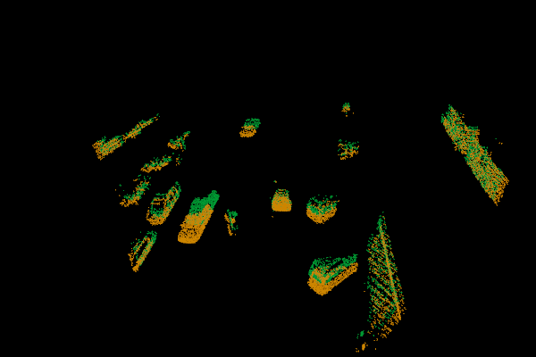
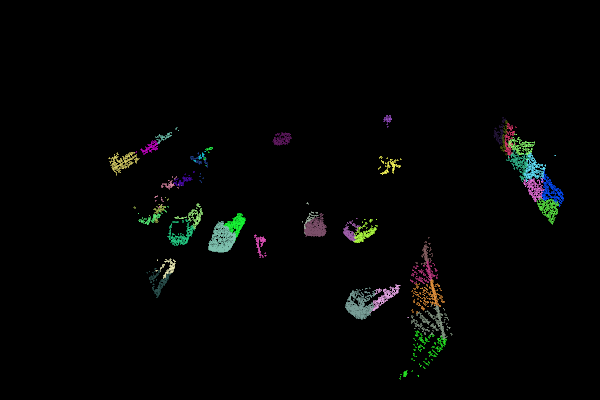
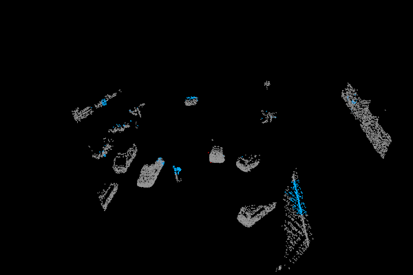

# Self-Supervised 3D Scene Flow Estimation Guided by Superpoint
This is the code for [SPFlowNet](https://openaccess.thecvf.com/content/CVPR2023/papers/Shen_Self-Supervised_3D_Scene_Flow_Estimation_Guided_by_Superpoints_CVPR_2023_paper.pdf), a self-supervised 3D scene flow estimation framework from 3D point clouds with dynamic superpoints. The code is created by Yaqi Shen (syq@njust.edu.cn).

### Introduction

This repository contains the source code and pre-trained models for SPFlowNet (published on CVPR 2023).



### Prerequisities
Our model is trained and tested under:

* Python 3.6.6
* CUDA 10.1
* Pytorch (torch == 1.4.0)
* scipy
* tqdm
* sklearn
* numba
* cffi
* yaml
* h5py

Build the ops. We use the operation from this [repo](https://github.com/fpthink/SPNet).

```shell
cd lib/pointops && python setup.py install && cd ../../
```

### Data preprocess

**FlyingThings3D**

For fair comparison with previous methods, we adopt the preprocessing steps in [HPLFlowNet](https://github.com/laoreja/HPLFlowNet). 

Download and unzip the "Disparity", "Disparity Occlusions", "Disparity change", "Optical flow", "Flow Occlusions" for DispNet/FlowNet2.0 dataset subsets from the [FlyingThings3D website](https://lmb.informatik.uni-freiburg.de/resources/datasets/SceneFlowDatasets.en.html) (we used the paths from [this file](https://lmb.informatik.uni-freiburg.de/data/FlyingThings3D_subset/FlyingThings3D_subset_all_download_paths.txt), now they added torrent downloads)
. They will be upzipped into the same directory, `RAW_DATA_PATH`. Then run the following script for 3D reconstruction:

```bash
python data_preprocess/process_flyingthings3d_subset.py --raw_data_path RAW_DATA_PATH --save_path SAVE_PATH/FlyingThings3D_subset_processed_35m --only_save_near_pts
```
This dataset is denoted FT3D<sub>s</sub> in our paper. 

**KITTI Scene Flow 2015**

* KITTI<sub>s</sub> dataset
  
For fair comparison with previous methods, we adopt the preprocessing steps in [HPLFlowNet](https://github.com/laoreja/HPLFlowNet).

Download and unzip [KITTI Scene Flow Evaluation 2015](http://www.cvlibs.net/download.php?file=data_scene_flow.zip) to directory `RAW_DATA_PATH`.
Run the following script for 3D reconstruction:

```bash
python data_preprocess/process_kitti.py RAW_DATA_PATH SAVE_PATH/KITTI_processed_occ_final
```
This dataset is denoted KITTI<sub>s</sub> in our paper.

* KITTI<sub>o</sub> dataset
  
For fair comparison with previous methods, we adopt the preprocessing steps in [FlowNet3D](https://github.com/xingyul/flownet3d).

Download and unzip [data](https://drive.google.com/open?id=1XBsF35wKY0rmaL7x7grD_evvKCAccbKi) processed by FlowNet3D to directory `SAVE_PATH`. This dataset is denoted KITTI<sub>o</sub> in our paper. 

* KITTI<sub>r</sub> dataset

Following [RigidFlow](https://github.com/L1bra1/RigidFlow), we also use [raw data](http://www.cvlibs.net/datasets/kitti/raw_data.php) from KITTI for self-supervised scene flow learning. 
The unlabeled training data provided by [RigidFlow](https://github.com/L1bra1/RigidFlow) can be found in [here](https://drive.google.com/file/d/12S69dpuz3PDujVZIcrDP_8H5QmbWZP9m/view?usp=sharing). This dataset is denoted KITTI<sub>r</sub> in our paper. 

### Get started

Here are some demo results in KITTI dataset:

  

## Train
**Train on non-occluded data**

Set `data_root` in `config_train_FT3D.yaml`  to `SAVE_PATH` in the data preprocess section. Then run
```bash
python train_FT3D.py ./configs_without_occlusions/config_train_FT3D.yaml
```

**Train on occluded data**

Similarly, specify `data_root` in `config_train_KITTI_r.yaml`. Then run 

```
python train_KITTI_r.py  ./configs_with_occlusions/config_train_KITTI_r.yaml
```

## Evaluate

We upload our pretrained models in ```pretrained```.

**Evaluate on non-occluded data**

Set `data_root` in `config_evaluate.yaml` to `SAVE_PATH` in the data preprocess section, and specify `dataset` in the configuration file `config_evaluate.yaml`. Then run
```bash
python evaluate.py ./configs_without_occlusions/config_evaluate.yaml
```

**Evaluate on occluded data**

Set `data_root` and `dataset` in the configuration file `config_evaluate_occ.yaml`. Then run
```bash
python evaluate_occ.py ./configs_with_occlusions/config_evaluate_occ.yaml
```

### SPFlowNet-V2
We redefine the encoding of current iteration information in our flow refinement module, which can achieve better experimental results (`model_v2.py`). 

## FT3d<sub>s</sub> dataset
|                                             | EPE | AS | AR | Out | pre-trained |
|---------------------------------------------|----------:|:-------:|:-------:|:-------:|:---------:|
| [SPFlowNet](model.py) |0.0606| 68.34 | 90.74 | 38.76 |[SPFlowNet_without_occ](https://github.com/supersyq/SPFlowNet/blob/main/pretrained/SPFlowNet_without_occ.pth) | 
| [SPFlowNet-V2](model_v2.py) |  0.0532  |  73.54  |  92.61  | 33.91   |[SPFlowNet_without_occ_v2](https://github.com/supersyq/SPFlowNet/blob/main/pretrained/SPFlowNet_without_occ_v2.pth) |

## KITTI<sub>s</sub> dataset
|                                             | EPE | AS | AR | Out | pre-trained |
|---------------------------------------------|----------:|:-------:|:-------:|:-------:|:---------:|
| [SPFlowNet](model.py) |0.0362| 87.24 | 95.79 | 17.71 |[SPFlowNet_without_occ](https://github.com/supersyq/SPFlowNet/blob/main/pretrained/SPFlowNet_without_occ.pth) | 
| [SPFlowNet-V2](model_v2.py)   | 0.0316 |  89.49  |   96.58 |  15.83 |[SPFlowNet_without_occ_v2](https://github.com/supersyq/SPFlowNet/blob/main/pretrained/SPFlowNet_without_occ_v2.pth) |

## KITTI<sub>o</sub> dataset
|                                             | EPE | AS | AR | Out | pre-trained |
|---------------------------------------------|----------:|:-------:|:-------:|:-------:|:---------:|
| [SPFlowNet](model.py) |0.086| 61.1 | 82.4 | 39.1 |[SPFlowNet_with_occ](https://github.com/supersyq/SPFlowNet/blob/main/pretrained/SPFlowNet_with_occ.pth) | 
| [SPFlowNet-V2](model_v2.py)  | 0.070 | 71.7 |  86.2  |   32.1  |[SPFlowNet_with_occ_v2](https://github.com/supersyq/SPFlowNet/blob/main/pretrained/SPFlowNet_with_occ_v2.pth) |

## Citation

If you find our work useful in your research, please consider citing:

```
@inproceedings{shen2023self,
  title={Self-Supervised 3D Scene Flow Estimation Guided by Superpoints},
  author={Shen, Yaqi and Hui, Le and Xie, Jin and Yang, Jian},
  booktitle={Proceedings of the IEEE/CVF Conference on Computer Vision and Pattern Recognition},
  pages={5271--5280},
  year={2023}
}
```

## Acknowledgement

Our code refers to [flownet3d_pytorch](https://github.com/hyangwinter/flownet3d_pytorch), [FLOT](https://github.com/valeoai/FLOT), [PointPWC](https://github.com/DylanWusee/PointPWC), [HPLFlowNet](https://github.com/laoreja/HPLFlowNet), [FlowStep3D](https://github.com/yairkit/flowstep3d), [RigidFlow](https://github.com/L1bra1/RigidFlow), and [SPNet](https://github.com/fpthink/SPNet). We want to thank the above open-source projects.
